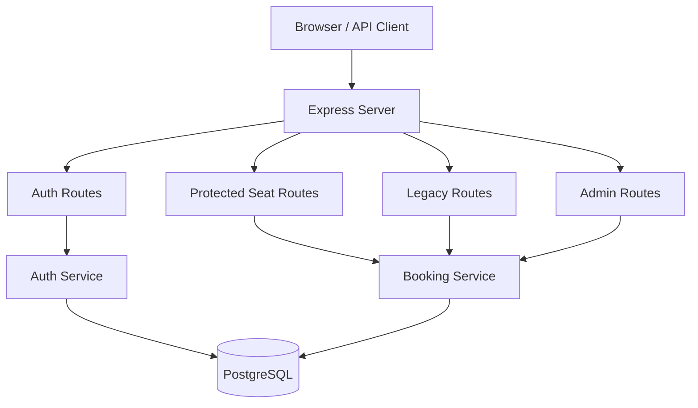
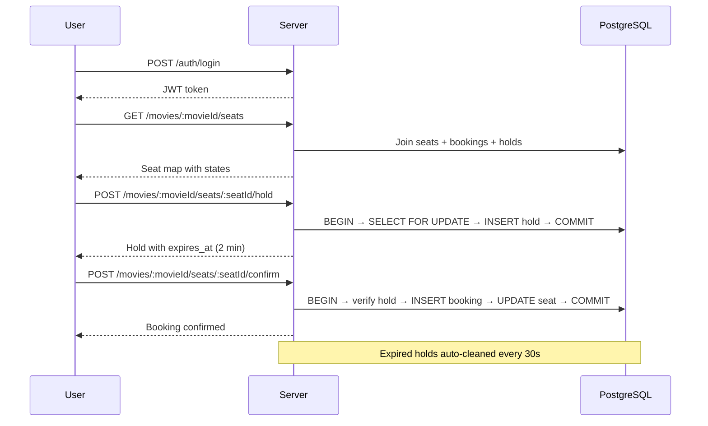
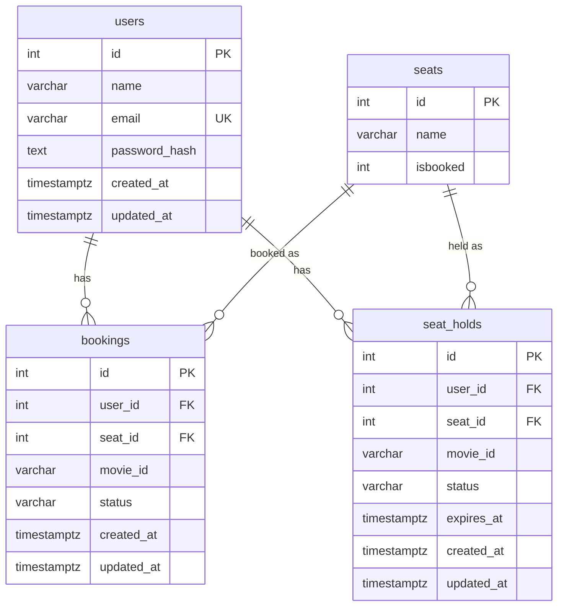

# BookMyTicket - Chai Code Hackathon 2026

A production-style seat booking platform built for the **Chai Code Web Dev Cohort 2026 Hackathon**. Extends the [starter codebase](https://github.com/chaicodehq/book-my-ticket) with JWT authentication, a BookMyShow-inspired seat hold/confirm flow, and a polished frontend.

## Tech Stack

- **Runtime:** Node.js
- **Framework:** Express 5
- **Database:** PostgreSQL (`pg`)
- **Auth:** JWT (`jsonwebtoken`) + bcrypt (`bcryptjs`)
- **Validation:** Zod
- **Security:** `express-rate-limit` on auth endpoints
- **Logging:** Morgan

## Architecture

```
src/
├── config/
│   ├── db.mjs            # PostgreSQL pool
│   └── env.mjs           # Environment config with defaults
├── middleware/
│   ├── auth.middleware.mjs    # JWT verification guard
│   └── error.middleware.mjs   # Global error handler + asyncHandler
├── routes/
│   ├── auth.routes.mjs    # POST /auth/register, /auth/login, GET /auth/me
│   ├── seat.routes.mjs    # Protected booking flow
│   ├── admin.routes.mjs   # Reset + stats (dev)
│   └── legacy.routes.mjs  # Original starter endpoints (preserved)
├── services/
│   ├── auth.service.mjs       # Register, login, user lookup
│   ├── booking.service.mjs    # Hold, confirm, release, reset, cleanup
│   ├── schema.service.mjs     # Auto-migration on startup
│   └── errors.mjs             # AppError class
├── validation/
│   ├── auth.validation.mjs    # Email + strong password rules
│   └── booking.validation.mjs # Route param schemas
├── utils/
│   └── jwt.mjs            # Sign / verify helpers
├── jobs/
│   └── hold-cleanup.job.mjs  # Periodic expired hold cleanup
└── app.mjs                # Express app factory
```

### System Flow



### Booking Flow (BookMyShow-Inspired)



### Database Schema



## Setup

### 1. Clone and install

```bash
git clone https://github.com/Armaan-Dip-Singh-Maan/Chai-Code-Hackathon.git
cd Chai-Code-Hackathon
npm install
```

### 2. Configure environment

```bash
cp .env.example .env
```

Edit `.env` with your PostgreSQL credentials:

```env
DATABASE_URL=
DB_HOST=localhost
DB_PORT=5432
DB_USER=your_pg_user
DB_PASSWORD=your_pg_password
DB_NAME=sql_class_2_db
JWT_SECRET=a_strong_random_secret
JWT_EXPIRES_IN=2h
DB_SSL=false
```

`DATABASE_URL` is optional for local development. If provided, it takes priority over `DB_HOST/DB_PORT/DB_USER/DB_PASSWORD/DB_NAME`.

### 3. Create database

```bash
createdb sql_class_2_db
```

Tables are auto-created on startup via `ensureSchema()`. You can also run manually:

```bash
psql -d sql_class_2_db -f sql/001_init_schema.sql
```

### 4. Start

```bash
npm start       # production
npm run dev     # watch mode (auto-restart)
```

Server runs at `http://localhost:8080`.

## Deploy on Vercel + Neon

### 1. Push your repository

```bash
git push origin main
```

### 2. Create Neon database

In Neon dashboard:

- Create a project and database
- Open **Connection Details**
- Select **Pooled connection**
- Copy the full pooled URL:
  `postgresql://<user>:<password>@<host>/<db>?sslmode=require...`

### 3. Configure Vercel env vars

Set these variables in Vercel project settings (Production):

- `DATABASE_URL` (Neon pooled URL)
- `JWT_SECRET` (strong random string)
- `JWT_EXPIRES_IN` (`2h`)
- `HOLD_DURATION_SECONDS` (`120`)
- `HOLD_CLEANUP_INTERVAL_MS` (`30000`)

Optional fallback vars (not required when `DATABASE_URL` is set):

- `DB_HOST`, `DB_PORT`, `DB_USER`, `DB_PASSWORD`, `DB_NAME`, `DB_SSL`

### 4. Deploy

```bash
npx vercel deploy --prod --yes
```

### 5. Verify deployment

```bash
curl https://<your-project>.vercel.app/health
```

Expected response:

```json
{
  "status": "ok",
  "db": "connected"
}
```

## API Reference

### Legacy Endpoints (preserved from starter)

| Method | Path | Auth | Description |
|--------|------|------|-------------|
| GET | `/` | No | Serves frontend |
| GET | `/seats` | No | List all seats |
| PUT | `/:id/:name` | No | Legacy seat booking |

### Auth

| Method | Path | Auth | Description |
|--------|------|------|-------------|
| POST | `/auth/register` | No | Create account (name, email, strong password) |
| POST | `/auth/login` | No | Login, returns JWT |
| GET | `/auth/me` | Bearer | Current user profile |

### Protected Booking

| Method | Path | Auth | Description |
|--------|------|------|-------------|
| GET | `/movies/:movieId/seats` | Bearer | Seat map with availability |
| POST | `/movies/:movieId/seats/:seatId/hold` | Bearer | Hold a seat (2 min) |
| DELETE | `/movies/:movieId/seats/:seatId/hold` | Bearer | Release your hold |
| POST | `/movies/:movieId/seats/:seatId/confirm` | Bearer | Confirm booking from hold |
| GET | `/me/bookings` | Bearer | Your booking history |

### System

| Method | Path | Auth | Description |
|--------|------|------|-------------|
| GET | `/health` | No | DB connectivity + uptime |
| GET | `/admin/stats` | No | DB counts (users, bookings, holds) |
| POST | `/admin/reset` | No | Reset all bookings and seats |

## Password Policy

Registration requires a strong password:

- Minimum 6 characters
- At least 1 uppercase letter (A-Z)
- At least 1 lowercase letter (a-z)
- At least 1 number (0-9)
- At least 1 special character (!@#$%... etc.)

## Concurrency & Duplicate Prevention

- All seat operations use `SELECT ... FOR UPDATE` inside transactions
- Unique partial index on `bookings(seat_id, movie_id)` where `status = 'booked'`
- Unique partial index on `seat_holds(seat_id, movie_id, status)` where `status = 'active'`
- Background job expires stale holds every 30 seconds
- HTTP status codes for fast client recovery: `409 seat_taken`, `410 hold_expired`, `404 hold_not_found`

## Wait Time Reduction Strategy

Inspired by BookMyShow and District:

1. **Seat hold before commit** -- users get a 2-minute exclusive window instead of racing on final booking
2. **Short transaction windows** -- DB locks held only during atomic operations
3. **Explicit release** -- users can cancel holds, freeing seats immediately for others
4. **Auto-expiry** -- unclaimed holds expire and become available automatically
5. **Rate limiting** -- prevents abuse on auth endpoints (30 req / 15 min)

## Sample cURL

```bash
# Register
curl -X POST http://localhost:8080/auth/register \
  -H "Content-Type: application/json" \
  -d '{"name":"Armaan","email":"armaan@example.com","password":"Secret@123"}'

# Login
curl -X POST http://localhost:8080/auth/login \
  -H "Content-Type: application/json" \
  -d '{"email":"armaan@example.com","password":"Secret@123"}'

# Hold seat (use token from login response)
curl -X POST http://localhost:8080/movies/dhurandhar-the-revenge/seats/4/hold \
  -H "Authorization: Bearer <TOKEN>"

# Confirm booking
curl -X POST http://localhost:8080/movies/dhurandhar-the-revenge/seats/4/confirm \
  -H "Authorization: Bearer <TOKEN>"

# Release hold
curl -X DELETE http://localhost:8080/movies/dhurandhar-the-revenge/seats/4/hold \
  -H "Authorization: Bearer <TOKEN>"

# Health check
curl http://localhost:8080/health

# Admin stats
curl http://localhost:8080/admin/stats
```

## Frontend

A minimal but polished BookMyShow-inspired UI is included at `index.html`:

- Dark cinema theme with glassmorphism cards
- Auth modal with tabbed Sign In / Create Account
- Real-time seat grid with 4 visual states (available, held, your hold, booked)
- Confirm booking modal with countdown timer
- Toast notifications
- My Bookings section with ticket cards

## License

ISC
